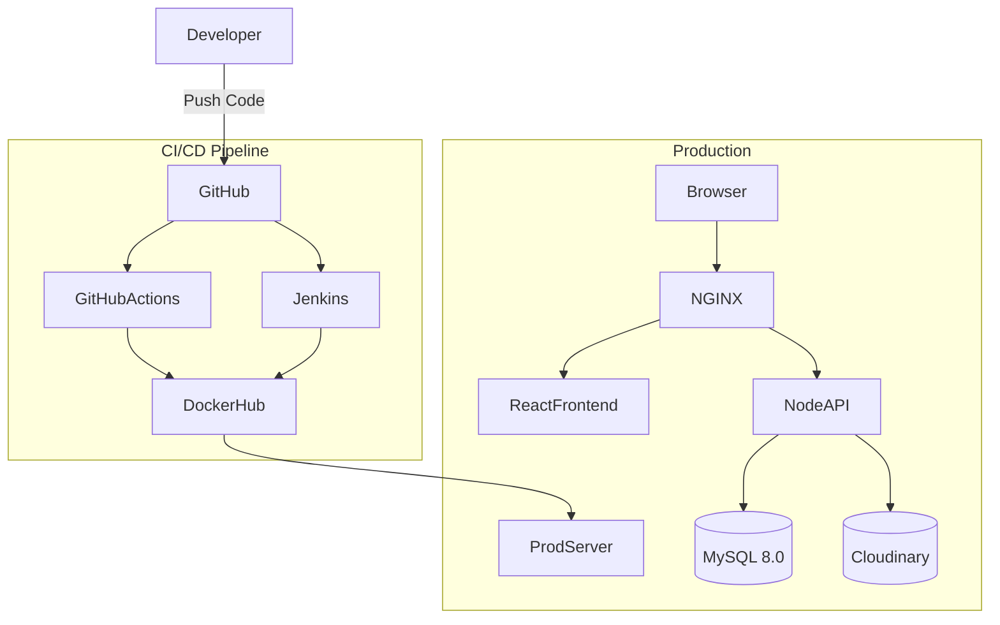

# 🎓 EzyEduTube (Education-Only Online Learning Platform)


---

## 🚀 Overview

EzyEduTube is a **full-stack learning platform** providing a **distraction-free educational environment**. It organizes educational videos, notes, and practice questions into structured course paths while filtering out non-educational content.

The project uses **MySQL + Cloudinary** for its data layer, with **Sequelize ORM** for schema management, and is wrapped in a **cloud-native Docker** setup with automated CI/CD.

---

## ✨ Key Features

* 📚 Structured course-based learning system
* ☁️ Cloudinary storage for videos, thumbnails & documents
* 🗄️ MySQL relational database with Sequelize ORM
* 🚫 Distraction-free platform (no irrelevant content)
* 🤖 AI-powered content filtering (keyword + YouTube category check)
* 🔐 Secure JWT authentication (local + Google OAuth)
* 👥 Role-based access: `admin`, `teacher`, `user`
* 🐳 Docker Containerization (dev + production)
* ⚙️ Automated CI/CD via GitHub Actions & Jenkins
* 🌐 NGINX reverse proxy

---

## 🏗️ Architecture



---

## 🛠️ Tech Stack

| Layer    | Technology                       |
| -------- | -------------------------------- |
| Frontend | React.js, Tailwind CSS           |
| Backend  | Node.js, Express.js              |
| Database | **MySQL 8.0** (via Sequelize ORM)|
| Storage  | **Cloudinary** (video/image/PDF) |
| Auth     | JWT + Google OAuth2              |
| DevOps   | Docker, Docker Compose           |
| CI/CD    | GitHub Actions, Jenkins          |
| Gateway  | NGINX                            |

---

## 📁 Project Structure

```text
EzyEduTube/
├── client/                     # React + Vite frontend
├── server/                     # Node.js + Express backend
│   ├── config/
│   │   ├── database.js         # Sequelize MySQL connection
│   │   ├── cloudinary.js       # Cloudinary + Multer config
│   │   └── passport.js         # Google OAuth strategy
│   ├── models/
│   │   ├── index.js            # Associations (relationships)
│   │   ├── User.js
│   │   ├── Course.js
│   │   ├── Video.js
│   │   ├── Document.js
│   │   ├── Enrollment.js
│   │   ├── Progress.js
│   │   ├── Comment.js
│   │   └── Notification.js
│   ├── controllers/
│   ├── routes/
│   ├── middleware/
│   ├── migrate_mongo_to_mysql.js  # Data migration script
│   └── index.js
├── nginx/
├── docker-compose.yml          # Dev (MySQL + Mongo side-by-side)
├── docker-compose.prod.yml     # Production
└── README.md
```

---

## 🔑 Environment Variables

Copy `server/.env.example` to `server/.env` and fill in your values:

```env
PORT=5000

# MySQL (primary database)
DB_HOST=127.0.0.1
DB_USER=root
DB_PASSWORD=root
DB_NAME=ezyedutube

# MongoDB (only needed to run the migration script)
MONGO_URI=mongodb://127.0.0.1:27017/eduhub

# Auth
JWT_SECRET=your_jwt_secret
CLIENT_URL=http://localhost:5174

# Google OAuth (optional)
GOOGLE_CLIENT_ID=your_client_id
GOOGLE_CLIENT_SECRET=your_client_secret
GOOGLE_CALLBACK_URL=http://localhost:5000/api/auth/google/callback

# Cloudinary (get from cloudinary.com dashboard)
CLOUDINARY_CLOUD_NAME=your_cloud_name
CLOUDINARY_API_KEY=your_api_key
CLOUDINARY_API_SECRET=your_api_secret
```

### Setting Up Cloudinary
1. Sign up at [cloudinary.com](https://cloudinary.com) (free tier available).
2. Go to **Dashboard → API Keys**.
3. Copy `Cloud Name`, `API Key`, and `API Secret` into `.env`.

---

## 🐳 Docker Setup & Commands

### Prerequisites
- [Docker](https://docs.docker.com/get-docker/) & [Docker Compose](https://docs.docker.com/compose/install/)

### Local Development (Hot-Reload)

```bash
docker-compose up --build
```

This starts:
| Service | URL |
|---------|-----|
| Frontend | http://localhost:5173 |
| Backend API | http://localhost:5000 |
| MySQL | localhost:3306 |

### Production Deployment

```bash
docker-compose -f docker-compose.prod.yml up -d --build
```

Application accessible via NGINX at `http://localhost`.

### Stop All Containers

```bash
docker-compose down
```

### Remove MySQL Volume (reset DB)

```bash
docker-compose down -v
```

---

## 🗄️ Database Schema (Relational)

```
users (id, username, email, password, role, googleId, avatar)
  └─ courses (id, title, description, subject, thumbnailUrl, teacherId→users)
        └─ videos (id, title, videoUrl, thumbnailUrl, duration, views, courseId, uploaderId)
        └─ documents (id, title, documentUrl, type, courseId)
  └─ enrollments (id, status, studentId→users, courseId→courses)
  └─ progress (id, watchedSeconds, completed, studentId→users, videoId→videos)
  └─ notifications (id, type, title, message, link, read, recipientId→users)

videos └─ comments (id, content, userId→users, videoId→videos)
users ↔ users (Subscriptions — self-referential many-to-many)
users ↔ videos (VideoLikes — many-to-many)
```

---

## 📦 Data Migration (MongoDB → MySQL)

If you have existing data in MongoDB, run the migration script **after** MySQL is up:

```bash
# 1. Make sure both MongoDB and MySQL are running
# 2. Set MONGO_URI and DB_* in server/.env

cd server
npm run migrate
```

The script:
- Reads all `Users`, `Videos`, `Comments`, `Notifications`, and `Subscriptions` from MongoDB.
- Maps MongoDB ObjectIds → MySQL integer IDs.
- Wraps all existing videos under a **"Legacy Migrated Content"** course.
- Idempotent per-record (skips duplicates with a warning).

---

## 🔌 API Endpoints

| Method | Endpoint | Auth | Description |
|--------|----------|------|-------------|
| POST | `/api/auth/register` | ❌ | Register user |
| POST | `/api/auth/login` | ❌ | Login |
| GET | `/api/auth/:id` | ❌ | Get user by ID |
| GET | `/api/videos` | ❌ | All videos |
| GET | `/api/videos/:id` | ❌ | Single video + comments |
| POST | `/api/videos/upload` | ✅ | Upload video (Cloudinary) |
| DELETE | `/api/videos/:id` | 🔐 Admin | Delete video |
| POST | `/api/videos/:id/like` | ❌ | Like/Unlike |
| POST | `/api/videos/:id/comments` | ❌ | Post comment |
| GET | `/api/courses` | ❌ | All courses |
| GET | `/api/courses/:id` | ❌ | Course with videos |
| POST | `/api/courses` | ✅ | Create course |
| POST | `/api/courses/:id/enroll` | ✅ | Enroll in course |
| GET | `/api/courses/my/enrollments` | ✅ | My enrollments |
| GET | `/api/notifications/:userId` | ❌ | User notifications |

---

## ⚙️ CI/CD Pipelines

### GitHub Actions (`.github/workflows/ci-cd.yml`)
Triggers on push to `main` — builds, tests, and pushes Docker images.

### Jenkins (`Jenkinsfile`)
Triggered via GitHub Webhook — full build + push + deploy pipeline.

---

## 🔮 Future Scope

* 💳 Payment Integration
* 📊 User Analytics Dashboard
* 🧠 AI-based Recommendations
* ☸️ Kubernetes Orchestration
* 🔒 SSL/TLS with Certbot

---

## 👨‍💻 Author

**Abhilash Kumar Jha**
B.Tech CSE | Full Stack Developer | DevOps Enthusiast

---

## ⭐ Support

If you like this project, give it a ⭐ on GitHub!
