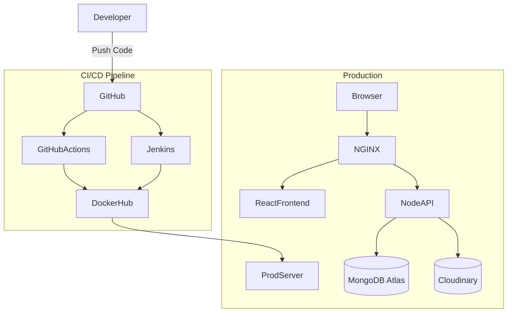

# 🎓 EzyEduTube (Education-Only Online Learning Platform)


---

## 🚀 Overview

EzyEduTube is a **full-stack learning platform** providing a **distraction-free educational environment**. It organizes educational videos, notes, and practice questions into structured course paths while filtering out non-educational content using AI.

The project uses **MongoDB Atlas + Cloudinary** for its data layer, with **Mongoose ODM** for schema management, and is wrapped in a **cloud-native Docker** setup with automated CI/CD.

---

## ✨ Key Features

* 📚 Structured course-based learning system
* ☁️ Cloudinary storage for videos, thumbnails & documents
* 🍃 MongoDB Atlas cloud database with Mongoose ODM
* 🚫 Distraction-free platform (no irrelevant content)
* 🤖 AI-powered content filtering (keyword + YouTube category check)
* 🔐 Secure JWT authentication (local + Google OAuth)
* 👥 Role-based access: `admin`, `teacher`, `user`
* 🐳 Docker Containerization (dev + production)
* ⚙️ Automated CI/CD via GitHub Actions & Jenkins
* 🌐 NGINX reverse proxy

---

## 🏗️ Architecture


```mermaid
graph TD
    Developer --> |Push Code| GitHub

    subgraph CI/CD Pipeline
        GitHub --> GitHubActions
        GitHub --> Jenkins
        GitHubActions --> DockerHub
        Jenkins --> DockerHub
    end

    subgraph Production
        DockerHub --> ProdServer
        Browser --> NGINX
        NGINX --> ReactFrontend
        NGINX --> NodeAPI
        NodeAPI --> MongoDBAtlas[(MongoDB Atlas)]
        NodeAPI --> Cloudinary[(Cloudinary)]
    end
```

---

## 🛠️ Tech Stack

| Layer    | Technology                       |
| -------- | -------------------------------- |
| Frontend | React.js, Tailwind CSS           |
| Backend  | Node.js, Express.js              |
| Database | **MongoDB Atlas** (via Mongoose) |
| Storage  | **Cloudinary** (video/image/PDF) |
| Auth     | JWT + Google OAuth2              |
| DevOps   | Docker, Docker Compose           |
| CI/CD    | GitHub Actions, Jenkins          |
| Gateway  | NGINX                            |

---

## 📁 Project Structure

```text
EzyEduTube/
├── client/                     # React + Vite frontend
├── server/                     # Node.js + Express backend
│   ├── config/
│   │   ├── database.js         # Mongoose MongoDB Atlas connection
│   │   ├── cloudinary.js       # Cloudinary + Multer config
│   │   └── passport.js         # Google OAuth strategy
│   ├── models/
│   │   ├── index.js            # Mongoose models aggregator
│   │   ├── User.js
│   │   ├── Course.js
│   │   ├── Video.js
│   │   ├── Document.js
│   │   ├── Enrollment.js
│   │   ├── Progress.js
│   │   ├── Comment.js
│   │   ├── Notification.js
│   │   └── VideoView.js
│   ├── controllers/
│   ├── routes/
│   ├── middleware/
│   └── index.js
├── nginx/
├── docker-compose.yml          # Dev setup
├── docker-compose.prod.yml     # Production setup
└── README.md
```

---

## 🔑 Environment Variables

Copy `server/.env.example` to `server/.env` and fill in your values:

```env
PORT=5000

# MongoDB Atlas
MONGODB_URI=mongodb+srv://<username>:<password>@<cluster>.mongodb.net/EzyEduTube?retryWrites=true&w=majority

# Auth
JWT_SECRET=your_jwt_secret
CLIENT_URL=http://localhost:5174

# Google OAuth (optional)
GOOGLE_CLIENT_ID=your_client_id
GOOGLE_CLIENT_SECRET=your_client_secret
GOOGLE_CALLBACK_URL=http://localhost:5000/api/auth/google/callback

# Cloudinary (get from cloudinary.com dashboard)
CLOUDINARY_CLOUD_NAME=your_cloud_name
CLOUDINARY_API_KEY=your_api_key
CLOUDINARY_API_SECRET=your_api_secret
```

### MongoDB Atlas Setup
1. Create a free cluster on [MongoDB Atlas](https://www.mongodb.com/cloud/atlas).
2. Create a Database User with read/write access.
3. In **Network Access**, allow access from anywhere (`0.0.0.0/0`) or whitelist your Render server IP.
4. Click **Connect** → **Drivers** (Node.js) and copy the connection string into `MONGODB_URI`.
5. You can also connect directly via **MongoDB Compass** using the same connection string.

### Setting Up Cloudinary
1. Sign up at [cloudinary.com](https://cloudinary.com) (free tier available).
2. Go to **Dashboard → API Keys**.
3. Copy `Cloud Name`, `API Key`, and `API Secret` into `.env`.

---

## 🐳 Docker Setup & Commands

### Prerequisites
- [Docker](https://docs.docker.com/get-docker/) & [Docker Compose](https://docs.docker.com/compose/install/)

### Local Development (Hot-Reload)

```bash
docker-compose up --build
```

### Production Deployment

```bash
docker-compose -f docker-compose.prod.yml up -d --build
```

Application accessible via NGINX at `http://localhost`.

### Stop All Containers

```bash
docker-compose down
```

---

## 🔌 API Endpoints

| Method | Endpoint | Auth | Description |
|--------|----------|------|-------------|
| POST | `/api/auth/register` | ❌ | Register user |
| POST | `/api/auth/login` | ❌ | Login |
| GET | `/api/auth/user/:id` | ❌ | Get user by ID |
| GET | `/api/videos` | ❌ | All approved videos |
| GET | `/api/videos/:id` | ❌ | Single video + comments |
| POST | `/api/videos/upload` | ✅ | Upload video (Cloudinary metadata) |
| DELETE | `/api/videos/:id` | 🔐 Admin | Delete video |
| POST | `/api/videos/:id/like` | ❌ | Like/Unlike |
| POST | `/api/videos/:id/comments` | ❌ | Post comment |
| GET | `/api/courses` | ❌ | All courses |
| GET | `/api/courses/:id` | ❌ | Course with videos |
| POST | `/api/courses` | ✅ | Create course |
| POST | `/api/courses/:id/enroll` | ✅ | Enroll in course |
| GET | `/api/courses/my/enrollments` | ✅ | My enrollments |
| GET | `/api/notifications/:userId` | ❌ | User notifications |
| GET | `/api/download/formats` | ❌ | Fetch video download formats |
| GET | `/api/download/stream` | ❌ | Stream video file download |

---

## 🚀 Render Deployment Notes

When deploying the backend on Render:
1. In the **Render Dashboard → Environment Variables**, add:
   - `MONGODB_URI`: Your MongoDB Atlas URI.
   - `JWT_SECRET`: Your production JWT secret.
   - `CLOUDINARY_CLOUD_NAME`, `CLOUDINARY_API_KEY`, `CLOUDINARY_API_SECRET`.
   - `CLIENT_URL`: `https://ezy-edu-tube-education-only-online.vercel.app`.
   - `GOOGLE_CLIENT_ID`, `GOOGLE_CLIENT_SECRET`, `GOOGLE_CALLBACK_URL`.
2. Delete the old Railway MySQL variables (`DB_HOST`, `DB_PORT`, `DB_USER`, `DB_PASSWORD`, `DB_NAME`, `DB_SSL`) from the Render dashboard.

---

## 👨‍💻 Author

**Abhilash Kumar Jha**
B.Tech CSE | Full Stack Developer | DevOps Enthusiast
